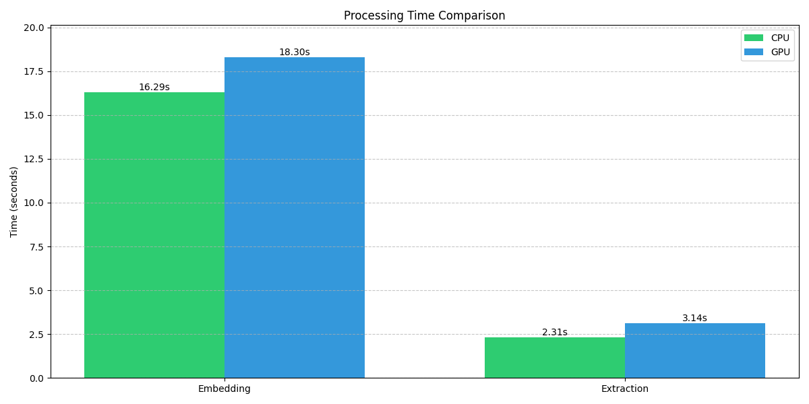
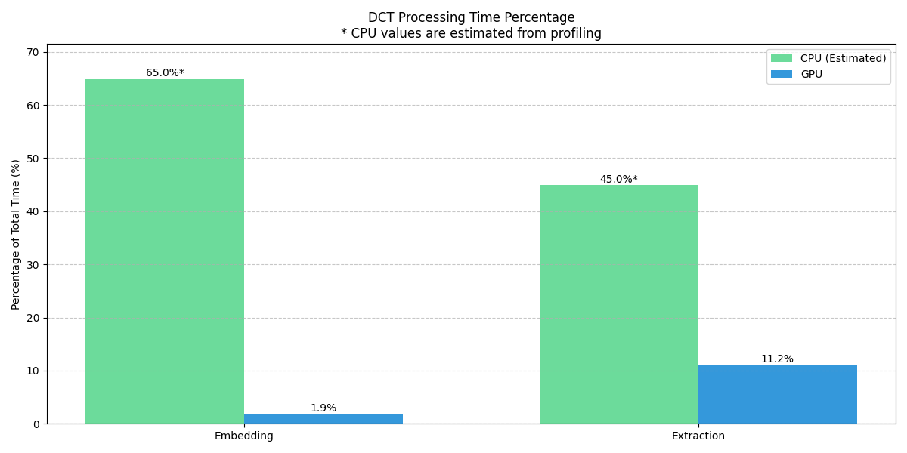
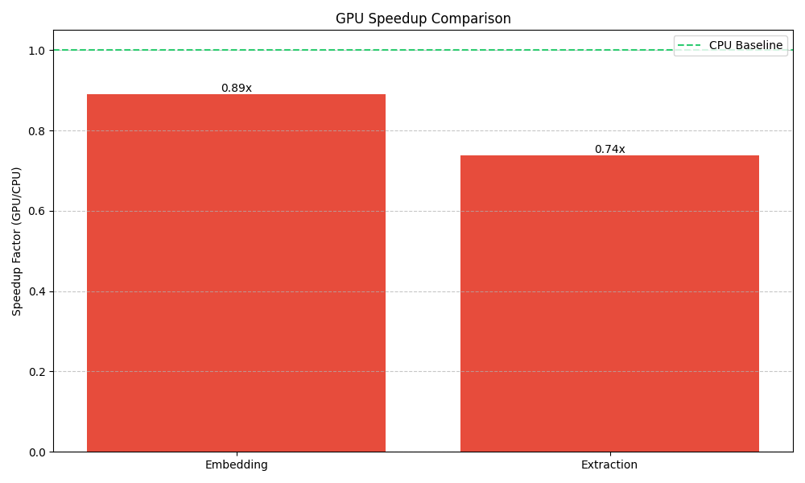

# GPU vs CPU Performance Comparison

## Embedding Performance

| Metric                 |   CPU |   GPU | Speedup   |
|:-----------------------|------:|------:|:----------|
| Raw Execution Time (s) | 15.11 | 19.98 | 0.76x     |
| Average PSNR (dB)      | 58.7  | 58.7  | +0.00     |
| Output File Size (MB)  |  5.11 |  5.11 | 1.00x     |

## Extraction Performance

| Metric                 |   CPU |   GPU | Speedup   |
|:-----------------------|------:|------:|:----------|
| Raw Execution Time (s) |  2.26 |  2.93 | 0.77x     |
| Bit Error Rate (%)     |  2.56 |  2.56 | +0.00     |

## Performance Visualization

### Processing Time Comparison

### DCT Processing Time Percentage

### GPU Speedup Comparison

